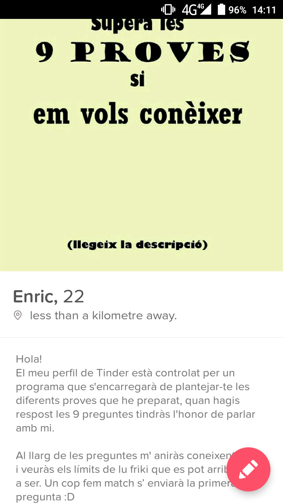
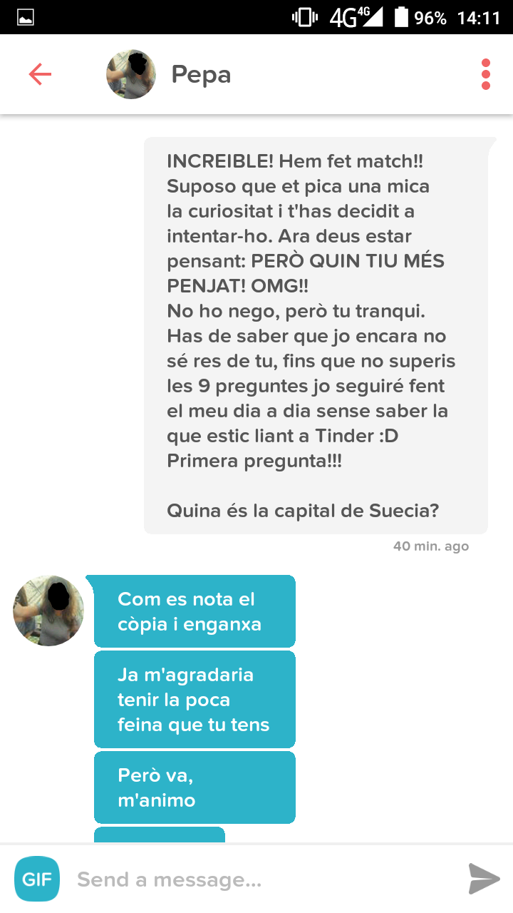
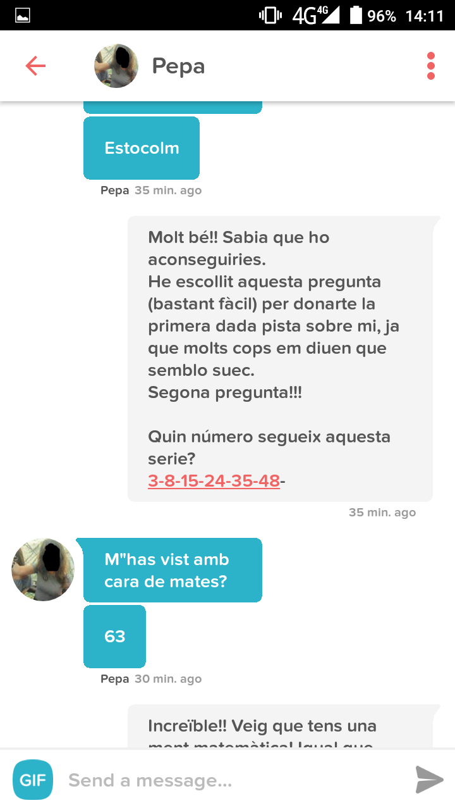
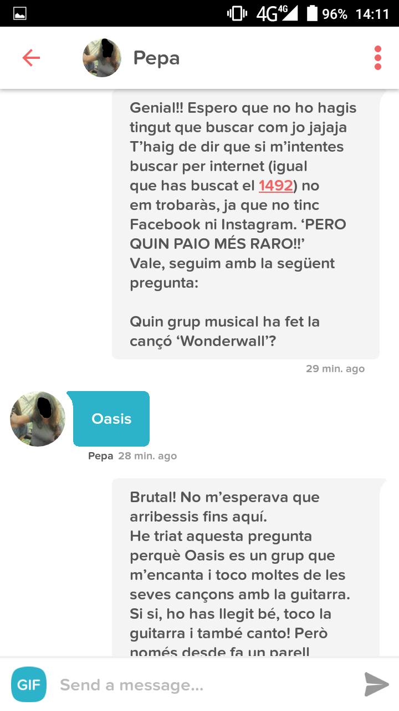
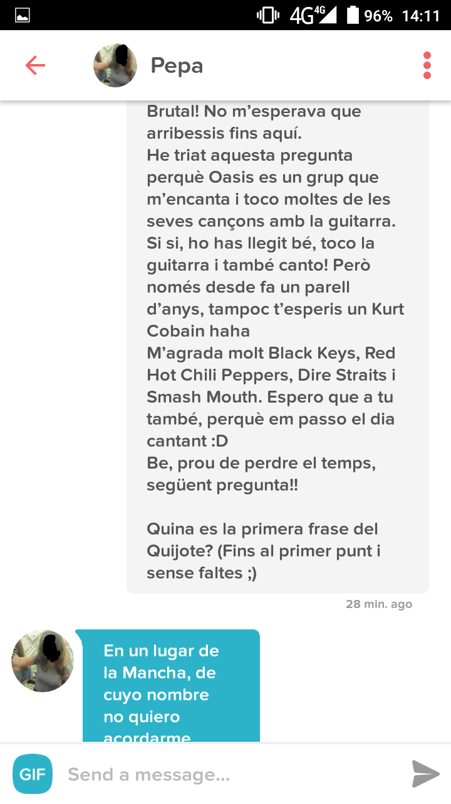
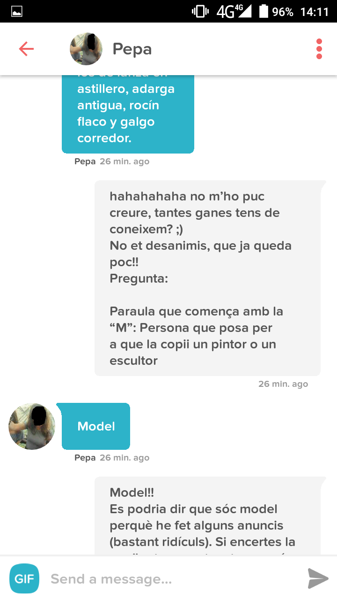
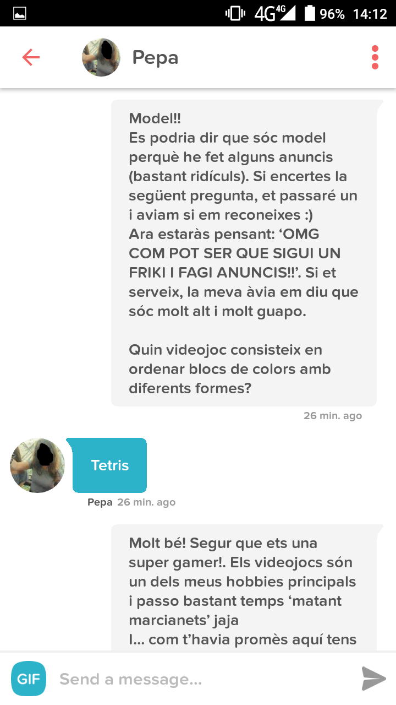
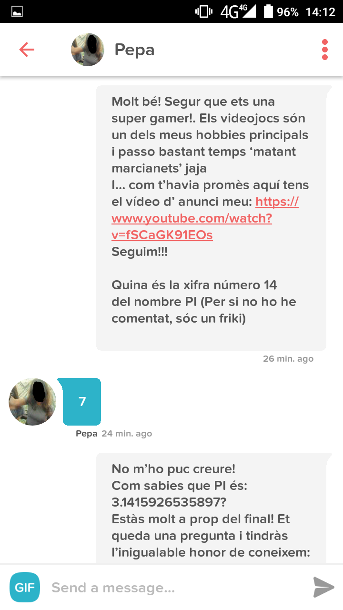
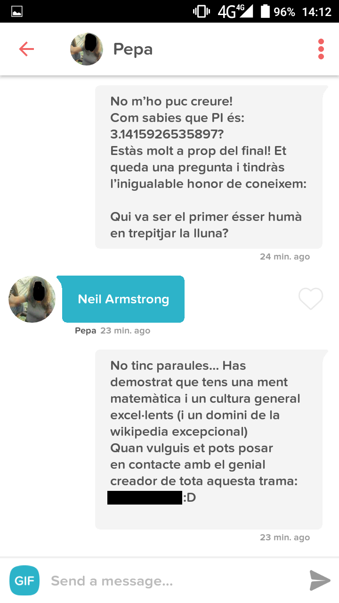
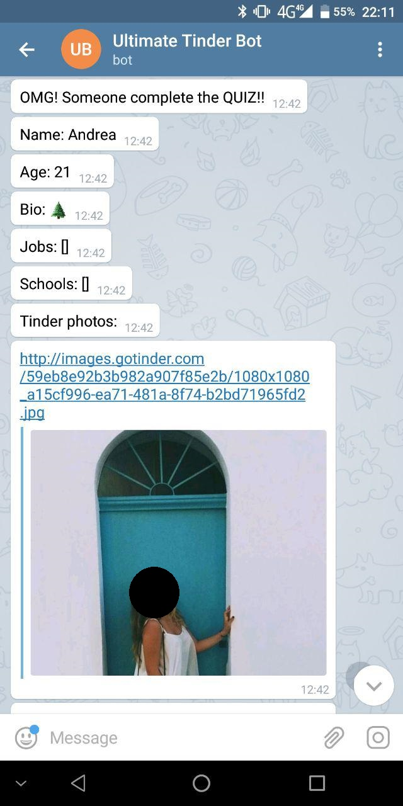

This Tinder bot is a **gamechat** where girls are challenged to answer 9 questions correctly

My system perform two operations:
* Hit random likes (200 per day)
* Answer questions to my matches

## Example

Here's my profile photo (I focused on catalan girls, so all the texts are in Catalan):

 

Basically, I present myself and explain the challenge.

Then, when the bot match with a girl, it sends the first question: **Wich is the capital of Sweden?**

And when the bot detects the correct answer (Estocolm in Catalan) it sends the next question:

  

   
   
  

And so on...

 
  

     
     
  

   

     
     
  

  

     
     
  
 

___

### Integration with Telegram

I used Telegram bot that inform me of the new girls that complete the quiz:

 

### Infrastructure
* In order to communicate with the Tinder API I used [this](https://github.com/charliewolf/pynder) Python wrapper.
* The full system was deployed at AWS (Amazon Web Services) under a free tier machine.

